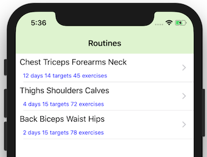
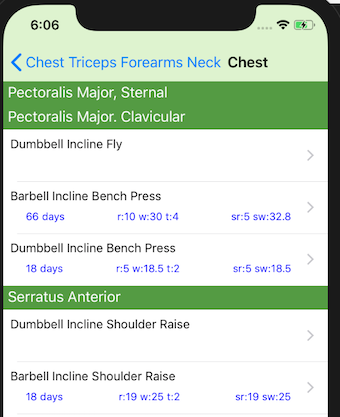
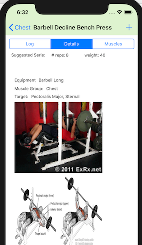

# balanced-gym-ios

Draft release of an app for iphone and apple watch

## Summary

 Smart fitness assistant and workout tracker for iOS. Revolutionary algorithm to create routines on the fly based on log history using IA. MVP targeted for product hun

## Technologies
 Xcode, Swift 4, WatchOS, Alamofire, AlamofireObjectMapper

## Screenshots
1- Select a Routine:

2-Select a Muscle Group

3- Select an exercise base on target muscle. Exercises are sorted using Smart Health Algorithm

4-Exercise details includes execution animation, muscles (target, synergists) and log to store latest executions

This tool complements with the [Balanced Gym Web app](https://github.com/papesce/balanced-gym)